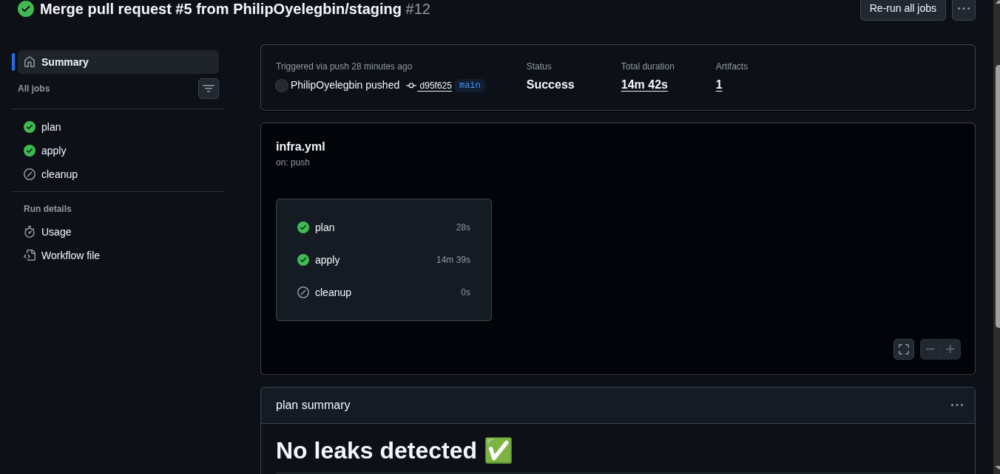
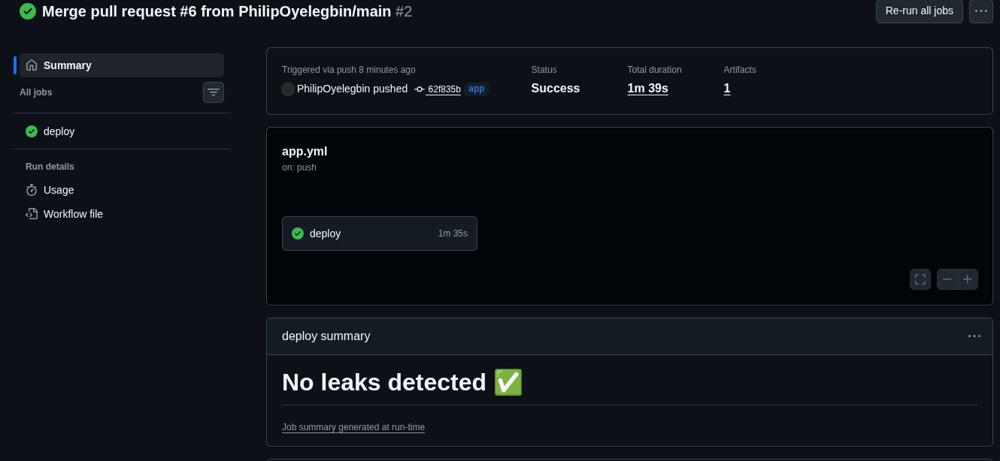
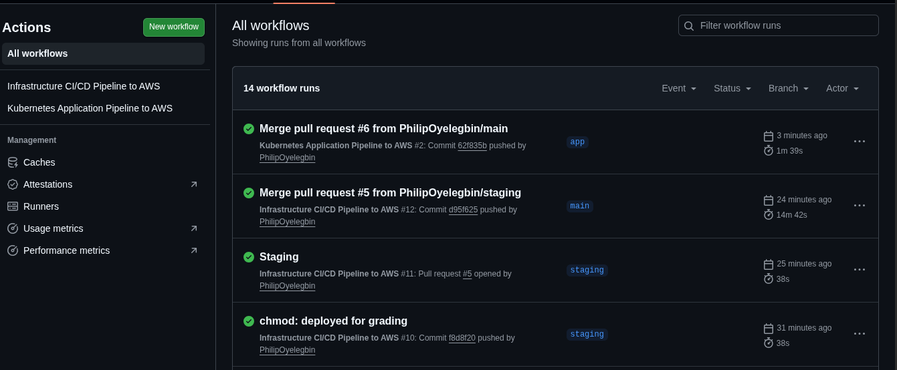
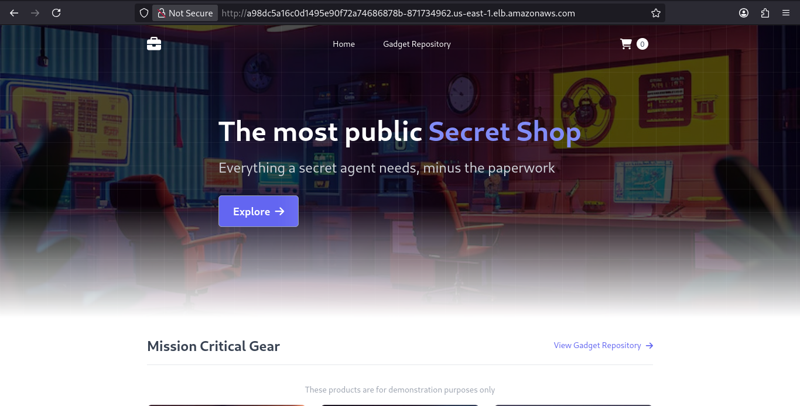

# Capstone Project - Production-Grade Microservices on AWS EKS

As our new Cloud DevOps Engineer, you are entrusted with **"Project Bedrock."** Your mission is to provision our first production-grade Kubernetes environment on AWS and deploy the new Retail Store Application. This foundation will dictate our ability to deliver a world-class shopping experience.

**Objectives**

Your objective is to provision a secure Amazon EKS cluster and deploy the AWS Retail Store Sample App. You must automate the infrastructure, secure developer access, implement observability, and extend the architecture with event-driven serverless components.
Success looks like: A fully automated infrastructure pipeline, a running application, centralized logging, and a secured cluster ready for developer hand-off.

---

## 🛠️ Requirements

- Terraform v1.14.3
- AWS CLI
- Helm

---

## 📂 Project Structure

```
barakat-2025-capstone/
├── .github/
│   └── workflows/
│       ├── app.yml
│       └── infra.yml
├── terraform/
│   ├── main.tf
│   ├── variables.tf
│   ├── outputs.tf
│   ├── remote/
│   ├── modules/
│   │   ├── eks/
│   │   ├── iam/
│   │   ├── serverless/
│   │   └── vpc/
│   └── terraform.tfvars.example
├── scripts/
│   ├── deploy-app.sh
│   ├── deploy-infra.sh
│   ├── destroy-app.sh
│   └── destroy-infra.sh
└── README.md
```

---

## 👨🏽‍💻 Setup Instructions

### Phase 1: Infrastructure Deployment

- Clone the repo to your local machine

  ```bash
  git clone https://github.com/PhilipOyelegbin/barakat-2025-capstone.git

  cd barakat-2025-capstone
  ```

- Run the deployment script below to setup remote state and application infrastructure

  ```bash
  chmod 740 script/*

  ./script/deploy-infra.sh
  ```

### Phase 2: Application Deployment

- Run the command below to deploy the application using helm

  ```bash
  ./script/deploy-app.sh <AWS_ACCESS_KEY_ID> <AWS_SECRET_ACCESS_KEY> <AWS_REGION>
  ```

> On successful deployment, open your browser and navigate to the load balancer dns.

### Phase 3: Secure Developer Access, Event-Driven Extension and Logging

- Login to the aws console using the developer user created
- Navigate to S3 bucket to upload an image file to the bucket name: `bedrock-assets-altsoe0251574`.
- Navigate to Lambda Monitor tab to view the log of triggered event
- Navigate to cloud watch to view your application logs from the log group created

Destroy the application and infrastucture by running the command below

```bash
./scripts/destroy-infra.sh
```

---

## ♻️ CI/CD Implementation

The CI-CD pipeline runs based on the updated folder. If the terraform folder is updated, the `infra.yml` pipeline is triggered. When the script folder is updated, the `app.yml` pipeline is triggered.

**Infrastructure Pipeline**

- Plan: This phase is triggered when an update is made to the terraform folder and pushed to the **staging** branch
- Apply: This phase is triggered when a PR is merged to the **main** branch from the **staging** branch.
- Cleanup: This phase is triggered when a PR is merged to the **clean** branch.



**Application Pipeline**

- Deploy: This phase is triggered when a PR is merged to the **app**.





---

## 🎯 Task Completed

- [x] Infrastructure as Code (IaC)
- [x] Application Deployment
- [x] Secure Developer Access
- [x] Observability (Logging)
- [x] Event-Driven Extension (Serverless)
- [x] CI/CD Automation

---
